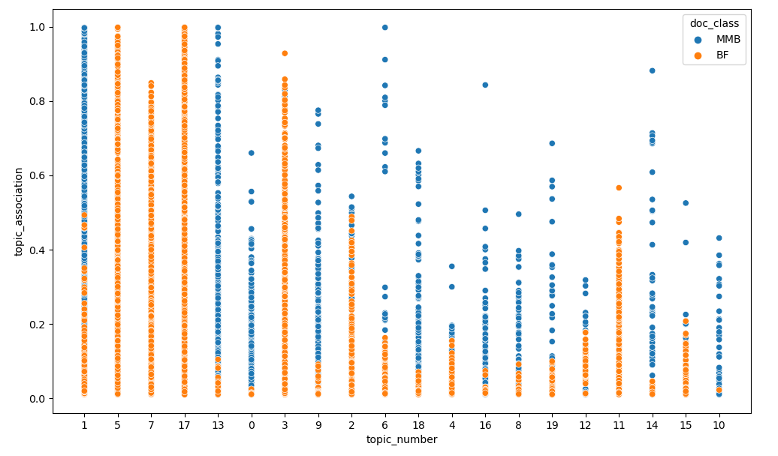

# Final Report: he Black Fantastic - Curated Vocabularies, Artifact Analysis, and Identification
Clarissa West-White, Seretha Williams, Ryan Dubnicek, and Isabella Magni[^1]

## Introduction and Context
The term “Afrofuturism” has often been used to describe works in which artists and creators of the African Diaspora engage with intersections of race and technology. A less contested term coined by Richard Iton, "the Black Fantastic," better reflects transcultural iterations of world-building (Iton, 2008). While there is an active scholarly community studying the Black Fantastic[^2], the use of computational methods in this study is inhibited by a lack of digital collections of Black Fantastic literature. 

The rise of digital libraries has led to new studies and insights into forms and histories of literary genres (Schöch, 2017; Underwood, 2016; Gittel, 2021; Wilkens, 2016), before genre-specific texts can be studied algorithmically, they must first be identified amidst the massive holdings of digital libraries, such as those of the HathiTrust. The first phase of this project therefore consisted in using text similarity methods to uncover Black Fantastic texts that may be hidden in the HathiTrust digital collections thanks to incomplete metadata or to cataloging practices not conducive to fine-grained genre identification. Once these volumes were identified (see [Introduction](https://htrc.github.io/scwared-black-fantastic/introduction.html) for more details), we began the analysis phase. One of the goals was to identify potential overlaps between the black fantastic volumes identified in HathiTrust, and a dataset of Mary McLeod Bethune’s digitized documents, to support the claim that Mary McLeod Bethune is one of the early twentieth century Black Fantastic thinkers and writers[^3].  

## Data and Methods
The preliminary analysis performed for this project was based on two main datasets: Mary McLeod Bethune’s digitized collections, and black fantastic volumes found in HathiTrust.
1. The Black Fantastic workset of volumes found in the HathiTrust digital library consists of thirty-nine distinct titles (see [Introduction](https://htrc.github.io/scwared-black-fantastic/introduction.html) for more details): fiction written between 1899 and 2003, adhering to characteristics of the Black Fantastic described above. In the course of the project, we digitized 5 additional volumes (see [Gap-Filling](https://htrc.github.io/scwared/gap-filling.html) report for more details) of identified Black Fantastic texts that were not present in the HathiTrust collections. These volumes are now available in HathiTrust Digital Library but were not part of this analysis.
2. Mary McLeod Bethune’s dataset is made of different types of documents that were digitized from the collection housed at Bethune-Cookman University: documents include letters to and from Mary McLeod Bethune, articles by and about Bethune, and other materials such as documents related to teaching and education. All of these documents were OCRed and transformed into plain text files in preparation for analysis. 

To investigate the question of whether we could find textual evidence of the connection between Bethune and the Black Fantastic, we first sought to identify elements of Black Fantastic texts. We performed keyword search and analysis using a manually-curated list of BF thematic terms (see the introduction to the Black Fantastic workset for the list of terms), additional, unguided lexical analysis using term frequency - inverse document frequency (TF-IDF) and performed latent dirichlet allocation (LDA) topic modeling on both Black Fantastic and Bethune-authored texts. Each methodological approach brought coinciding affordances and constraints, which we’ll report on fully in following sections.  

### Limitations
Limitations of preliminary analysis and results go hand in hand with limitations of the worksets. Some key aspects to consider are the relatively small size of data available for analysis (that is, the size of the worksets), and the different nature of the two worksets we are comparing, for example in terms of genre and, potentially, writing styles. MMB documents particularly are more mixed than the BF texts, containing personal letters, essays, articles, transcripts of speeches directly authored by MMB, but also articles about her. This mix of documents was intentional, but brings with it a more varied number of writing styles and publication dates, which likely challenged our methods. Lastly, we had an imbalanced set of documents with MMB documents numbering 1321

Data format can also be a key factor in the success of computational methods, as algorithms directly crunch digitized versions of titles. MMB documents were partially hand-keyed into digital form, as compared to automatic optical character recognition (OCR) methods used to digitize HathiTrust Digital Library items. Though not explicitly a limitation, we also wish to foreground that identification of a subgenre of fiction is a difficult task for human experts. Though we were optimistic for success, we also would encourage measured expectations for algorithmic success for such tasks.

## Preliminary Results
### _Uncovering the Black Fantastic_
Given the multi-prong approach of this project, our first task was to assemble as exhaustive a list of BF texts in the HTDL as possible. The methods leveraged to do this ranged from author-title matching from external bibliographies, thematic keyword searches within the larger workset of Black-authored fiction assembled as part of the History of Black Writing’s SCWAReD project, and even predictive modeling. We found success in assembling the workset from external bibliographies, though were surprised to find a small number of BF titles in the HTDL. Other techniques failed to bring success in identifying more titles in the larger collection, speaking to both the difficulty of the task and the unfortunately circular nature of the problem of gaps in our cultural record–i.e.to successfully train a predictive model, we need more example data, which we were not able to find with more simplistic methods. However, though our set of result volumes was small, they did represent a valid basis for computational analysis.

Algorithmic analysis supported the presence and prevalence of the thematic terms identified by Black Fantastic subject experts, but without surfacing runaway sets of terms. However, frequency of time-related terms emerged as a previously unobserved trend in BF texts. Time-related words were far more prevalent than the most popular thematic terms manually identified (see Table 1.). Though not entirely surprising given the speculative nature of BF writing, this result was unexpected, with themes of technology and magic more often the focus of BF thematic analysis.

| Black Fantastic - Time Terms |           |       | Black Fantastic - Thematic Terms |               |       |
| ---------------------------- | --------- | ----- | -------------------------------- | ------------- | ----- |
| Term                         | POS tag   | Count | Term                             | POS tag       | Count |
| time                         | Noun      | 22440 | passing                          | Verb          | 708   |
| day                          | Noun      | 8620  | dreams                           | Noun          | 664   |
| soon                         | Adverb    | 5304  | witch                            | Noun          | 244   |
| moment                       | Noun      | 5232  | ghosts                           | Noun          | 172   |
| later                        | Adverb    | 3636  | imperium                         | Noun - proper | 156   |
| remember                     | Verb      | 2612  | illusion                         | Noun          | 132   |
| year                         | Noun      | 2452  | angels                           | Noun          | 128   |
| ago                          | Adverb    | 2176  | angels                           | Noun - proper | 124   |
| tomorrow                     | Noun      | 1468  | psychic                          | Adjective     | 80    |
| past                         | Adjective | 1220  | passing                          | Noun          | 76    |

_Table 1: Top 10 thematic keywords versus time-related keywords in Black Fantastic texts._

Lastly, though largely conducted as an experiment to benchmark text classification methods for genre fiction, we conducted experiments with supervised machine learning to explore the possibility for finding more Black Fantastic volumes with the HTDL that might be hidden due to poor or incomplete metadata. This machine learning approach was successful in identifying Black-authored fiction from a comparative set of texts, but struggled to isolate Black Fantastic titles within that set, indicating that more advanced models and more training data are necessary for reliable genre fiction identification.  This project is detailed in full in a paper presented at the 2022 Association for Information Science and Technology (ASIS&T) annual meeting (see: Parulian, et al., 2022)

### Mary McLeod Bethune as a Black Fantastic Writer
The secondary focus of our analysis was to investigate if Mary McLeod Bethune’s writings contained elements of Black Fantastic texts. This was explored using lexical analysis and topic modeling. Preliminary topic modeling results did not show a clear connection between the Mary McLeod Bethune set and the Black Fantastic set, though more advanced methods could potentially yield a stronger signal. There is some overlap, as shown in Figure 1 below, but in general, topics are rather demarcated: where both MMB and BF documents share a topic, one type of documents tends to have a high association and the other low, indicating little thematic overlap between documents.

_Figure 1: Results of LDA topic model document clustering, 20 topics. Little overlap between orange and blue dots illustrates minor thematic overlap between BF and MMB texts._

The topic with the most overlap between MMB and BF–meaning the topic that included the largest mix of documents from each category–was topic #1, with the most prominent words associated with this topic including “black,” “women,” “african,” “american,” “white,” “national,” “school,” “work,” “history,” “rights,” and “education,” indicating this topic is broadly related to politics, civil rights, race, and history. The strength of this topic mix between both BF and MMB texts would indicate that each set includes text influenced by contemporary political and civil rights concerns. Inclusion of “new,” “history,” “early,” “first,” “years,” and “could,” would also suggest a dimension of speculation within the discourse of this topic, an interesting if potentially expected finding. Results for 20 topics displayed the most intermingling between document classes, but more advanced topic modeling approaches or more granular data chunking (we define a “document” as a page of text) could possibly yield more topic overlap

More fruitfully, our lexical analysis–keyword counts and identification of prominent words using TF-IDF–found similarities in the prevalence and importance of time-related keywords to both BF and MMB texts. For example, a number of BF texts featured time-related terms within the highest ranking 50 terms calculated by TF-IDF (see Table 2), while Building a Better World, an anthology of MMB writings also returned time-related words with high-ranking TF-IDF values (see Table 3).

| Title                                         | Keyword | Word rank within volume | TF-IDF score |
| --------------------------------------------- | ------- | ----------------------- | ------------ |
| Night Studies: a Novel (by Cyrus Colter)   | time    | 1 / 6426                | 0.043        |
| Night Studies: a Novel                        | soon    | 40 / 6426               | 0.022        |
| Those the Sun has Loved (by Rose Jourdain) | moment  | 47 / 3998               | 0.009        |
| Kindred (by Octavia Butler)                | time    | 3 / 2128                | 0.019        |
| S.R.O (by Robert Deane Pharr)              | day     | 37 / 3402               | 0.017        |

_Table 2. Selected TF-IDF scores for high-ranking time-related terms in Black Fantastic texts_

| Keyword  | Word rank within volume | TF-IDF score |
| -------- | ----------------------- | ------------ |
| time     | 56 / 1321               | 0.02         |
| remember | 98 / 1321               | 0.015        |
| year     | 111 / 1321              | 0.015        |
| day      | 134 / 1321              | 0.013        |
| past     | 277 / 1321              | 0.009        |

_Table 3. Selected TF-IDF scores for high-ranking time-related terms in Mary McLeod Bethune’s Building a Better World anthology_

This preliminary analysis, while not conclusive, demonstrates that there is indeed some relation between Black Fantastic literature and Mary McLeod Bethune’s writings. However, to make a rigorous argument, more research is required, as are more and varied examples of Black Fantastic texts. Narrowing the scope of documents authored by MMB could also uncover a stronger signal between BF literature and MMB’s ideas and writings.

## Future Work and Potential Next Steps
Given the limited time available on this grant, the current study includes preliminary results that are affected by limitations in data and method. Though analysis did not achieve a clear answer to our research questions that we would have wanted, there are encouraging signs in the preliminary results. Our methods show promise for further investigation into the characteristics and elements of Black Fantastic literature, having uncovered an observable trend in the prevalence of time-related keywords in both sets of texts, as well as the potential for Mary McLeod Bethune’s writings to contain both thematic and lexical similarities with BF texts. More advanced document clustering or modeling techniques might also uncover more subtle trends that supervised methods miss. 

However, one of the strongest outcomes from this project and its many methodological experiments is that more digitized Black Fantastic volumes are needed. More data will improve both methods and the general exposure and study of an exciting and important genre of fiction. Similarly, continued preservation and digitization of Mary McLeod Bethune’s writings and documents will serve to both preserve important outputs from one of America’s greatest figures but also enable more contemporary and future study of Bethune’s life and legacy. Though we used algorithms to highlight the lack of data, the solution to these issues are not technical, which presents an exciting opportunity to make impactful change in this area of research.

## References
“About This Journal | Third Stone | Rochester Institute of Technology.” Accessed February 22, 2024. [https://scholarworks.rit.edu/thirdstone/about.html](https://scholarworks.rit.edu/thirdstone/about.html).

Gittel, Benjamin. “An Institutional Perspective on Genres: Generic Subtitles in German Literature from 1500-2020.” _Journal of Cultural Analytics_ 6, no. 1 (April 7, 2021): 22086. [https://doi.org/10.22148/001c.22086](https://doi.org/10.22148/001c.22086).

Iton, Richard. 2008. _In Search of the Black Fantastic. In: Politics and Popular Culture in the Post-Civil Rights Era. Transgressing Boundaries._ Oxford University Press.

Magni, Isabella, Glen Layne-Worthey, John A. Walsh, J. Stephen Downie, Maryemma Graham, Janet Swatscheno, and Ryan Dubnicek. “Report on HathiTrust Gap Filling.” HathiTrust Research Center, accessed February 26, 2024. [https://htrc.github.io/scwared/gap-filling.html](https://htrc.github.io/scwared/gap-filling.html). 

“Mary McLeod Bethune: The Black Fantastic.” Accessed February 22, 2024. [https://sites.google.com/cookman.edu/mmbtheblackfantastic/home](https://sites.google.com/cookman.edu/mmbtheblackfantastic/home).

Parulian, Nikolaus Nova, Ryan Dubnicek, Glen Worthey, Daniel J. Evans, John A. Walsh, and J. Stephen Downie. “Uncovering Black Fantastic: Piloting A Word Feature Analysis and Machine Learning Approach for Genre Classification.” _Proceedings of the Association for Information Science and Technology_ 59, no. 1 (2022): 242–50. [https://doi.org/10.1002/pra2.620](https://doi.org/10.1002/pra2.620).

Schöch, Christof. “Topic Modeling Genre: An Exploration of French Classical and Enlightenment Drama.” _Digital Humanities Quarterly_ 011, no. 2 (May 22, 2017).

Underwood, Ted. “Genre Theory and Historicism.” _Journal of Cultural Analytics_ 2, no. 2 (October 25, 2016): 11063. [https://doi.org/10.22148/16.008](https://doi.org/10.22148/16.008). 

West-White, Clarissa, and Seretha Williams. “Introduction. The Black Fantastic: Curated Vocabularies, Artifact Analysis, and Identification.” HathiTrust Research Center, accessed February 26, 2024. [https://htrc.github.io/scwared-black-fantastic/introduction.html](https://htrc.github.io/scwared-black-fantastic/introduction.html). 

Wilkens, Matthew. “Genre, Computation, and the Varieties of Twentieth-Century U.S. Fiction.” _Journal of Cultural Analytics_ 2, no. 2 (November 1, 2016): 11065. [https://doi.org/10.22148/16.009](https://doi.org/10.22148/16.009). 

Williams, Seretha. “Black to the Future. 2023 _Black Ink Book Festival_ Virtual Kickoff Event (November 17, 2022).” [https://www.youtube.com/watch?v=QgpI_boeYWc](https://www.youtube.com/watch?v=QgpI_boeYWc). 

-----
[^1]: Clarissa West-White (Bethune-Cookman University, whitec@cookman.edu); Seretha Williams (Augusta University, seretha.williams@augusta.edu); Ryan Dubnicek (HathiTrust Research Center, University of Illinois Urbana-Champaign); Isabella Magni (University of Sheffield, i.magni@sheffield.ac.uk).

[^2]: “About This Journal. Third Stone. Rochester Institute of Technology.” Accessed December 10, 2021. [https://scholarworks.rit.edu/thirdstone/about.html](https://scholarworks.rit.edu/thirdstone/about.html). For more about Afrofuturism and the Black Fantastic see Dr. William’s public speech “Black to the Future—2023 Black Ink Book Festival Virtual Kickoff Event (November 17, 2022)”, available at [https://www.youtube.com/watch?v=QgpI_boeYWc](https://www.youtube.com/watch?v=QgpI_boeYWc).

[^3]: For further information regarding MMB’s writings and her links to the Black Fantastic see: [Mary McLeod Bethune](https://sites.google.com/cookman.edu/mmbtheblackfantastic/home): The Black Fantastic site.
